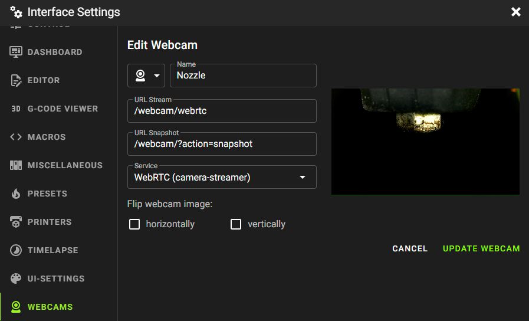
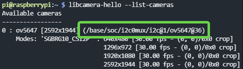

Crowsnest just recently made huge changes to the way it works. This is great news, because it should be much faster and more reliable. Unfortunately, it also means that there are major breaking changes, and you'll need to do some manual steps to upgrade. When you update to V4 through the machine tab in mainsail, crowsnest will stop working until you execute the following steps.

Make sure to read these instructions carefully before starting the process, so you don't miss anything. Just to be safe, download a copy of your crowsnest.conf.

## Upgrading

1. Update crowsnest in the machine tab in mainsail. Make sure it's >= v4.0.0.
2. Open a terminal window or command prompt (win + r, type cmd, hit enter) and ssh into your printer. The password is `raspberry` unless you changed it.

```
ssh pi@<your printer's hostname.local or ip address without the angle brackets>
```

## Uninstall old crowsnest

3. Run the following commands:

```
cd crowsnest
git checkout legacy/v3
make uninstall
```

4. When asked `Do you REALLY want to remove existing 'crowsnest'? (y/N)` delete the N and type "y" for "Yes", then hit enter.

5. When asked `do you want to remove crowsnest.conf` answer "N" for "No".

6. Ignore the instructions to remove the crowsnest folder.
7. Ignore the instructions to remove `[update manager crowsnest]` from moonraker.conf.

## Reinstall crowsnest

8. This next part will take a while, and you'll have to answer a couple of questions along the way.

```
git checkout master
sudo make install
```

9. When asked `Do you want to add 'update manager' entry to your moonraker.conf?` answer "N" for "No".

10. Ignore the instructions to add the crowsnest update manager entry manually (it's already there).

11. When asked to reboot, answer "Y" for "Yes".

12. After rebooting, go to the Machine tab in mainsail and edit crowsnest.conf. Enter your old settings from the file you downloaded, alternatively crowsnest should have created a backup file called crowsnest.conf.date-of-backup.

13. (Skip if not using a Raspberry Pi) In crowsnest.conf change `mode` to `camera-streamer`.
14. (Skip if not using a Raspberry Pi) Back in mainsail, edit your web camera settings and make sure the "Camera Streamer" option is selected.
15. (Skip if not using a Raspberry Pi) Change `URL Stream` and `URL Snapshot` to `webcam/webrtc`
    

You're now using Crowsnest v4, which should have much better performance.

Thanks to tomlawesome for the image!

## Making legacy CSI cameras work again (for example the raspberry pi cameras v1 or v2)

If you're using an older raspberry pi camera and it stopped working, you'll need to do some additional steps to make it work again.

1. Disable legacy camera support by running `sudo raspi-config` and selecting `3 Interface Options` -> `I1 Legacy Camera` -> `No`. Finally press escape to get out of raspi-config.
1. Edit /boot/config.txt by running `sudo nano /boot/config.txt`. Find the [all] section at the bottom. Depending on which camera you have, you'll need to add a `dtoverlay` set statement at the end of the [all] section. Here's a list of sensors and the corresponding set statements. Look up your particular camera to find out which sensor it uses.

| Model         | Set Statement                              | Known Cameras with this sensor |
| ------------- | ------------------------------------------ | ------------------------------ |
| OV5647        | dtoverlay=ov5647                           | Raspberry Pi Camera Module V1  |
| OV9281        | dtoverlay=ov9281                           | ?                              |
| IMX290/IMX327 | dtoverlay=imx290, clock-frequency=37125000 | ?                              |
| IMX378        | dtoverlay=imx378                           | ?                              |
| IMX219        | dtoverlay=imx219                           | Raspberry Pi Camera Module V2  |
| IMX477        | dtoverlay=imx477                           | Raspberry Pi HQ Camera         |

2. reboot with `sudo reboot`
3. reconnect to your printer with ssh
4. `libcamera-hello --list-cameras` should return something like this:
   
5. in this example `/base/soc/i2c0mux/i2c@1/ov5647@36` is the new device for crowsnest.conf
