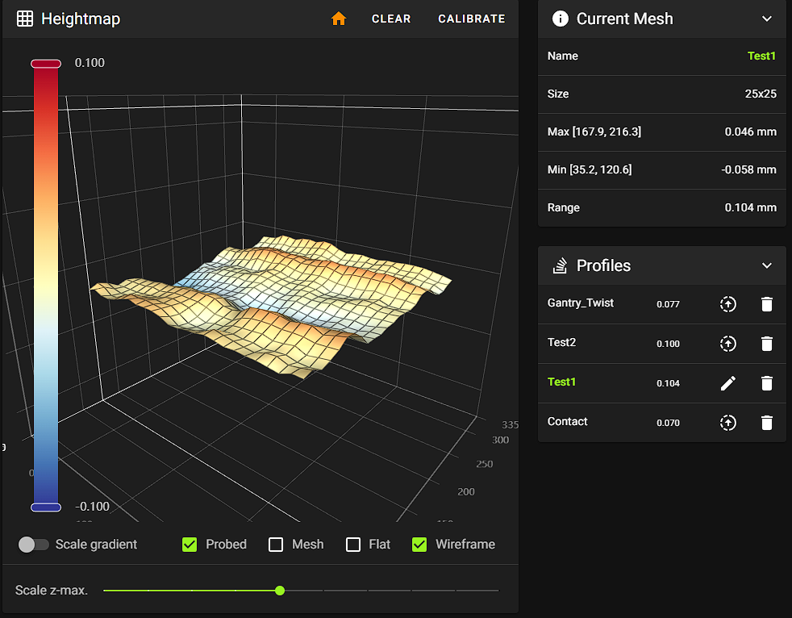
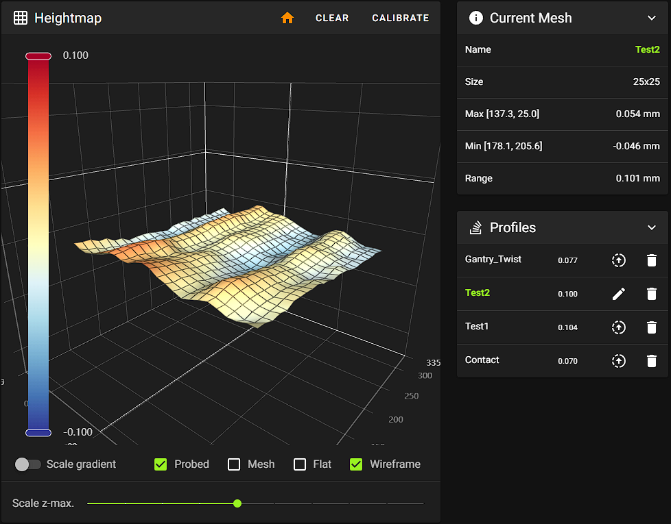

# RatOS 2.1 with Beacon Contact

- [Prerequisites](#prerequisites)
- [Fully automated RatOS Beacon calibration](#fully-automated-ratos-beacon-calibration)
- [Initial calibration](#1-initial-calibration)
- [Beacon latency check](#2-beacon-latency-check)
- [Temperature expansion calibration](#3-temperature-expansion-calibration)
- [Final calibration](#4-final-calibration)
- [Beacon Scan Compensation](#5-beta-automated-beacon-scan-compensation)
- [First print and fine tuning](#6-first-print-and-fine-tuning)
- [RatOS configuration](#7-ratos-configuration)
- [Beacon Tools](#8-tools)

## Prerequisites
- update RatOS 2.1 via mainsail
- read the official [beacon contact documentation](https://docs.beacon3d.com/contact/), but do not follow any installation instructions from there.

## NEW! Bed and hotend heat soaking time
It is recommended to use the new RatOS heat soaking variables. The beacon calibration and the Start print macro are using these values.

```
[gcode_macro RatOS]
variable_bed_heat_soak_time: 1200
variable_hotend_heat_soak_time: 300
variable_start_print_park_in: 'primeblob'
```

## Fully automated RatOS Beacon calibration
Ratos comes with a fully automated beacon model and temperature offset calibration.

By default the beacon contact feature is deactivated. If you want to use it and perform the needed calibrations you need to enable `beacon_contact_z_calibration`

- Run `BEACON_RATOS_CALIBRATE BED_TEMP=85 CHAMBER_TEMP=45`. Use your target temperature for the `BED_TEMP` and `CHAMBER_TEMP` parameter. `CHAMBER_TEMP` is optional, and can be omitted.

	The automated beacon calibration will run the following calibrations and tests, which can also be used individually. Please make sure to read every section before starting the calibration.
	- [Initial calibration](#1-initial-calibration)
	- [Beacon latency check](#2-beacon-latency-check)
	- [Temperature expansion calibration](#3-temperature-expansion-calibration) (for non IDEX printer)
	- [Final calibration](#4-final-calibration)
	- [Beacon scan compensation](#5-beta-automated-beacon-scan-compensation) *if [beacon_scan_compensation_enable: True](#7-ratos-configuration) a reference mesh will be created if needed*

	All calibration results will be saved automatically, there is no user action required. Klipper will restart by its own after the calibration is done.

## 1. Initial calibration
We need to create a intial beacon model to be able to home the printer.
- Run `BEACON_INITIAL_CALIBRATION`

	It will home your printer and run the calibration fully automated. This command can throw a tolerance error, in this case just repeat it until the command gets successfully completed.

	For safety and peace of mind, the LED will turn on as soon as the contact system determines it has a strong enough signal for detection. It should normally turn on up to 10mm in advance of the metal target, allowing enough time to manually estop the machine if necessary.

- Run `SAVE_CONFIG` to save the model to your printer.cfg file.

## 2. Beacon latency check
This test will show you the quality of your beacon probing.
- Run `BEACON_POKE_TEST`

	It will home your printer and poke the bed multiple times. After it check the console output, it should look like this:
```
Overshoot: 35.625 um
Triggered at: z=0.07369 with latency=2
Armed at: z=4.76021
Poke test from 5.000 to -0.300, at 3.000 mm/s
```

Compare your latency values with the following list.

| Score	| Notes |
| :------------ |:--------------- |
| 0-1	| Extremely low noise, rarely achieved
| 2-4	| Excellent performance for a typical printer
| 5-8	| Acceptable performance, machine may have considerable cyclic axis noise
| 9-11	| Not ideal, may want to verify proper mounting or use thinner stackups
| 12-14	| Reason for concern, present setup may be risky to continue with

## 3. Temperature expansion calibration
RatOS comes with a built in temperature expansion calibration and compensation.

**Preparation**
- Unload filament from the nozzle
- Make sure the nozzle is clean and that no filament is leaking out of it. Make a manual cold pull or use the RatOS `COLD_PULL` macro.
- Let the machine cool down to ambient temperature
- Do **NOT** make this calibration on a smooth PEI sheet, in this case turn the sheet arround and make the calibration on the bare metall of it.

**Cold Pull Macro**

The cold pull macro lets you perform a automated cold pull and cleans your nozzle. Before the cold pull 30mm of filament will be extruded with the `EXTRUSION_TEMP`.

The default values are good for PLA cold pulls, for PETG and ABS you should use something like `EXTRUSION_TEMP=250 COLD_PULL_TEMP=95`. If you hear skipping during the cold pull, raise the `COLD_PULL_TEMP` a bit.
```
COLD_PULL EXTRUSION_TEMP=220 COLD_PULL_TEMP=80 TOOLHEAD=0
```

**Single toolhead printer**
- Run `BEACON_CALIBRATE_NOZZLE_TEMP_OFFSET`

	It homes your printer and runs the calibration fully automated. This will take some time.

**IDEX printer**
- Start VAOC
- Center both nozzles over the camera
- Click the `Calibrate Thermal Expansion` button in VAOC

	It calibrates both nozzles fully automated. This will take some time.

It is recommended to repeat that process always when you change a nozzle and before loading any new filament into it.

After the test is finished check the console output, it should look like this typical result:
```
RatOS | Beacon: T0 expansion coefficient: 0.075000
```
This value is in mm and represents the thermal expansion for a temperature difference of 100°C. RatOS uses this value to calculate the needed offset and applies it automatically.

The result will be saved automatically to the configuration file, there is no user action required.

## 4. Final calibration
For the scan method z-homing we should create a beacon model under real conditions. This is optional but recommended.
- Run `BEACON_FINAL_CALIBRATION BED_TEMP=85 CHAMBER_TEMP=45`

	Use your target temperature for the `BED_TEMP` and `CHAMBER_TEMP` parameter. It will home your printer and run the calibration fully automated.

- Run `SAVE_CONFIG` to save the model to your printer.cfg file.

## 5. BETA! Automated Beacon Scan Compensation
With RatOS you can automatically compensate for gantry twist over the complete build plate and inaccuracies in the build sheets material thickness which causes a ripple effect on scanned bed meshes.

### How  do i know if i need this?

Measuring gantry twist

- `BEACON_MEASURE_GANTRY_TWIST` automatically measures the gantry twist on multiple locations on the bed. It will home your printer and level the bed if needed. The result will be displayed after the test has finished. The command can throw a tolerance error, in this case just repeat it until the command gets

The result will look like this.

```
Gantry twist relative to the center

Low gantry twist: 50.324232μm.
You may experience first layer inconsistensies, consider beacon scan compensation.

Front left: 2.362576μm
Front center: 16.475233μm
Front right: -47.959155μm
Left center: 24.925954μm
Right center: -22.468182μm
Back left: 50.324232μm
Back center: 37.143389μm
Back right: -4.167238μm
```

Check your build plate

- Make a scan bed mesh and save it as `Scan1`
- Rotate the build plate by 90° *only the sheet and not the bed*
- Make a second scan bed mesh and save it as `Scan2`
- if you see that the pattern follows the build plate you need this compensation

Scan 1



Scan 2 with the build plate rotated by 90°



Since this is still in beta you need to activate the feature manually. Copy this to your printer.cfg file.
```
[gcode_macro RatOS]
variable_beacon_scan_compensation_enable: True          # Enables the beacon scan compensation
```

- Run `BEACON_CREATE_SCAN_COMPENSATION_MESH BED_TEMP=85 CHAMBER_TEMP=45 PROFILE=Contact` to create a contact reference bed mesh.

	Use your target temperature for the `BED_TEMP` and `CHAMBER_TEMP` parameter. It will home your printer, heat it to target temp, waits for heat soaking and run the calibration fully automated.

- You'll need a reference contact mesh for each build plate and each time your target bed temperature changes more than 10 or 20 degrees (TBD). For example, if i primarily print ABS at 110 and PETG 80 both on the same powder coated sheet, i would need two contact meshes, one for 80 and one for 110. If i print at 90 and 110, i might be able to get away with a single contact mesh at 100c. You can create separate compensation meshes by running `BEACON_CREATE_SCAN_COMPENSATION_MESH` command with the `PROFILE` parameter. For example `BEACON_CREATE_SCAN_COMPENSATION_MESH PROFILE="PEI_PC_90"`

- Set the profile name for the wanted reference mesh profile in the gcode variable `beacon_scan_compensation_profile`. The default profile name is `Contact`

- If `BEACON_CREATE_SCAN_COMPENSATION_MESH` throws an error while meshing, you can jsut run `BED_MESH_CALIBRATE PROBE_METHOD=contact USE_CONTACT_AREA=1 SAMPLES=2 SAMPLES_DROP=1 SAMPLES_TOLERANCE_RETRIES=10 PROFILE=Contact`. This will skip the heat soaking part which isnt needed anymore in this case.

- If the feature is enabled it will automatically compensate while printing, there is no other user action requried. If you want to see the compensation for a manually created mesh, just open the mesh in mainsail and run `BEACON_APPLY_SCAN_COMPENSATION PROFILE=Contact` in the console, this will update the mesh in mainsail.


Click the image to to open the video and see the result in action

[](https://youtu.be/qjRhAHsX0Hc)

## 6. First print and fine tuning
- Print a 150x30mm one layer thick rectangle in the middle of the buildplate.
- While printing finetune with babystepping.
- Run `SAVE_Z_OFFSET` to save the changes. Dont click the button, type `SAVE_Z_OFFSET` into the console.

## 7. RatOS configuration
The beacon contact feature is activated by default, you dont need to do anything. But you can override the settings to enable more beacon contact features if wanted. Just copy and paste this complete block to your printer.cfg file and make the changes there.
```
#####
# Beacon probe configuration
#####
[gcode_macro RatOS]
variable_beacon_bed_mesh_scv: 25                        # square corner velocity for bed meshing with proximity method
variable_beacon_contact_z_homing: False                 # Make all G28 calls use contact instead of proximity scan
variable_beacon_contact_start_print_true_zero: True     # Use contact to determine true Z=0 for the last homing move during START_PRINT
variable_beacon_contact_wipe_before_true_zero: True     # enables a nozzle wipe at Y10 before true zeroing
variable_beacon_contact_true_zero_temp: 150             # nozzle temperature for true zeroing
                                                        # WARNING: if you're using a smooth PEI sheet, be careful with the temperature

variable_beacon_contact_prime_probing: True             # probe for priming with contact method
variable_beacon_contact_expansion_compensation: True    # enables the nozzle thermal expansion compensation

variable_beacon_contact_bed_mesh: False                 # bed mesh with contact method
variable_beacon_contact_bed_mesh_samples: 2             # probe samples for contact bed mesh

variable_beacon_contact_z_tilt_adjust: False            # z-tilt adjust with contact method
variable_beacon_contact_z_tilt_adjust_samples: 2        # probe samples for contact z-tilt adjust

variable_beacon_scan_compensation_enable: False         # Enables the beacon scan compensation
variable_beacon_scan_compensation_profile: "Contact"    # The contact profile name for the scan compensation
variable_beacon_scan_compensation_probe_count: 15,15    # The contact probe count for the scan compensation

variable_beacon_contact_poke_bottom_limit: -1		    # The bottom limit for the contact poke test
```

## 8. Tools

### Measuring z-axis backlash
With the beacon macro `BEACON_ESTIMATE_BACKLASH` you can measure the backlash of your setup. You need to home your printer and level your bed before using it.

```
Median distance moving up 1.99990, down 2.00286, delta 0.00296 over 20 samples
```

The delta value represents your backlash in mm.


